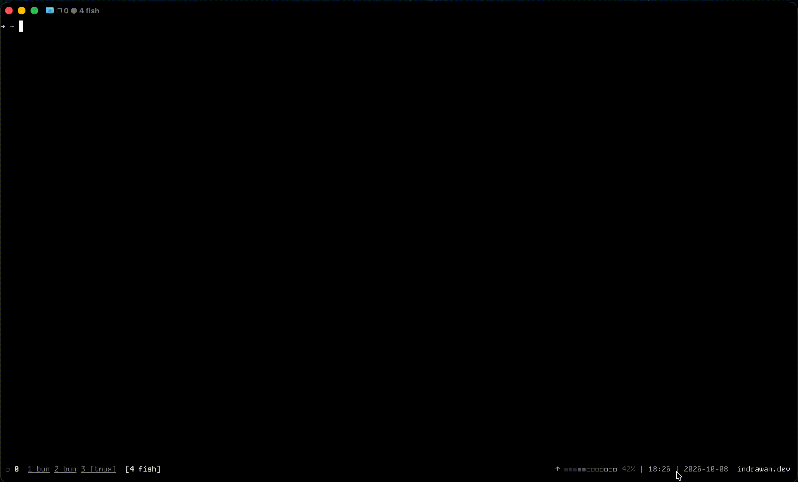

# lazyomo

TUI editor for `~/.omo/omo.jsonc` and the MCP servers file at `~/.omo/agent/mcp.json`, styled after lazygit.

It opens your live omo config and your MCP servers in the terminal so you can browse sections, tweak models and routing, manage servers, and inspect your providers and cached catalogs, then save once. Nothing touches disk until you confirm save, and every save leaves a timestamped backup next to the file.



## Layout

Three bordered panes over two fixed lines. The left column is a grouped side panel:

- **CONFIG** holds the editor's config sections: Models, Model Profiles, Agents, Categories, Telemetry, and Git, plus a read-only row for every other top-level key present in the file (for example `$schema`).
- **MCP** holds Servers (editable) and Tools (read-only).
- **PROVIDERS** holds Connections and Catalog (both read-only, derived from cache files).

The upper right pane lists the entries for the selected side row. The lower right pane is the detail view. Only one pane has focus at a time; the focused pane gets a green border and a `●` marker in its title, and the selected row uses a `❯` cursor, so color is never the only cue. The first fixed line is a keybar with the keys that apply to the focused pane. The second is a status line with the active file path, a clean or dirty counter, filter text, and the last message. Dialogs (edit, add, confirm, help, error, the MCP add flow, the secret reveal, and the model picker) open centered on top and take all input until you confirm or dismiss them.

## Install

Go install:

```bash
go install github.com/itokun99/lazyomo/cmd/lazyomo@latest
```

Build from source:

```bash
git clone https://github.com/itokun99/lazyomo.git
cd lazyomo
go build -o lazyomo ./cmd/lazyomo
```

npm:

```bash
npm install -g @itokun99/lazyomo
```

Requires Go 1.26.3 or later for source builds.

## Usage

```bash
lazyomo
```

It opens `~/.omo/omo.jsonc` for editing and `~/.omo/agent/mcp.json` for editing, and reads your provider and catalog caches for the read-only panes. Pass `--help` to print usage. There are no other flags.

## Keymap

Keys act on the focused pane unless noted. The keybar and the in-app help render from the same table, so they always match.

| Key | Action |
|-----|--------|
| `j` / `k` | Move selection down / up |
| `h` / `l` | Focus pane left / right |
| `tab` / `shift+tab` | Focus next / previous pane |
| `[` / `]` | Previous / next side row, keep focus |
| `1`-`9`, `0` | Jump to a side row and focus Entries |
| `enter` | Drill in (Sections to Entries to Detail), confirm in dialogs |
| `esc` | Step back (dialog to Detail to Entries to Sections) |
| `e` | Edit the selected value (opens the model picker on a model field) |
| `a` | Add an entry to the current section, or a server in the MCP list |
| `d` | Delete the selected entry or server (asks to confirm) |
| `space` | Toggle the selected bool, or a server's enabled flag |
| `x` | Reveal the selected server's `env`/`headers` values (MCP only) |
| `/` | Filter the entries list (`esc` clears an empty filter) |
| `s` | Save all changes (asks to confirm, writes a backup per file) |
| `r` | Reload from disk (asks to confirm when dirty, reloads at once when clean) |
| `?` | Open or close help |
| `q` | Quit (asks to confirm when dirty) |

In the model picker: type to filter, `enter` selects, `tab` toggles the preview column, `ctrl+e` escapes to raw text, and `esc` cancels without writing. `ctrl+c` quits from anywhere.

## Config and backups

The editor reads and writes two files: `~/.omo/omo.jsonc` (comment-preserving JSONC) and `~/.omo/agent/mcp.json` (strict JSON). The MCP agent directory is resolved from `OMO_CODING_AGENT_DIR`, then `SENPI_CODING_AGENT_DIR`, then `PI_CODING_AGENT_DIR`, then `~/.omo/agent`. A nearest project `.omo/omo.jsonc` found from the working directory up to your home directory is registered read-only and is not shown in this version.

Each confirmed save copies the pre-save file to a sibling backup named `<config>.bak.<UTC timestamp>`, for example `omo.jsonc.bak.2026-10-05T12-34-56-789Z`, then writes atomically. Each dirty file gets its own backup. Backups sit next to the file they belong to, never in another directory. If a file changed on disk since it was loaded, the save confirm marks it `stale, blocked` and its bytes stay untouched. `r` reloads from disk and drops unsaved edits (with confirm when dirty).

## What you can edit

| Section | Editable |
|---------|----------|
| `models.*` | Add or remove alias, edit `model`, edit `reasoning` |
| `model_profiles.*` | Add or remove profile, edit `display_name`, edit `models` chain |
| `model_profile` | Read-only display of the active profile or `provider/model` pin |
| `agents.*` | Edit `model`, `models` chain, `reasoning`, `disable`; add or remove overlay entry |
| `categories.*` | Edit `model`, `models` chain |
| `telemetry.enabled` | Bool toggle |
| `git_master.*` | Toggle `commit_footer` and `include_co_authored_by` (both default false) |
| MCP servers (`~/.omo/agent/mcp.json`) | Add, remove, rename a server; edit its fields; toggle `enabled` |

Everything else in `omo.jsonc` is read-only: each other present top-level key renders as its own read-only section, and the Detail pane tags those values `(read-only)`. Edit keys there report `read-only section` instead of opening a popup. Credentials under `~/.omo/agent/` are never read or written by the editor, and `mcp-auth/` is never touched.

A `model_profile` picker is not shipped in this version; the active value is display-only. Model ids are picked with a fuzzy picker: press `e` on a `model` field to search the live catalog and your document's aliases and refs, or press `ctrl+e` to type a value by hand.

## Read-only insight

Three panes show data the omo runtime maintains, refreshed when you open them:

- **Connections** reads `models.json` for your provider connections (name, api, baseUrl, model count).
- **Catalog** reads `models-store.json` for cached model catalogs (id, name, cost, context window).
- **Tools** reads `~/.omo/agent/cache/mcp-cache.json` for the tools each connected server exposes.

Each pane is provenance-badged `derived`, shows the source file and a refreshed-at timestamp, and never writes anything.

## Safety

Edits stay in memory until you press `s`. The status line shows `clean` or `dirty(n)` so you always know what is pending. Save writes atomically: it creates the timestamped backup above, then replaces the file, preserving comments and key order outside the edited subtree. Cancel paths (`esc`, quit without saving, reload) never write.

## Development

```bash
go build -o lazyomo ./cmd/lazyomo
go test ./...
go vet ./...
```

See [docs/spec-tui-v2.md](docs/spec-tui-v2.md) for the UI spec and [docs/spec-editor-v2.md](docs/spec-editor-v2.md) for the editing scope.

## License

MIT
